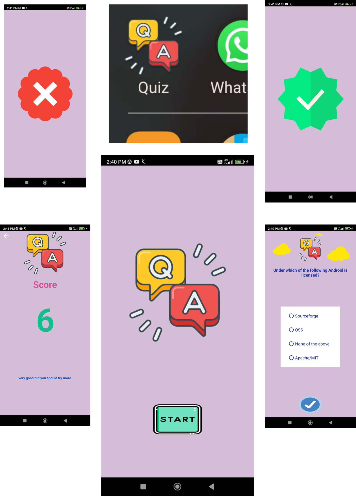

# Quiz app



Quiz app made for web programming Made with android studio

# Acquired knowledge
* Work with more than one **activity**
* The use of **RadioGroup** and **RadioButtom**
* Use the **Constraint layout**
* Send **data** from one **activity** to another
* Using `MediaPlayer` to play a sound in the app

# Questões do Quiz

As questões foram adicionadas pela classe `Question`

Classe `Question`

```java
public class Question {

    private String question;
    private List<String> answers = new ArrayList<>();
    private String rightAnswer;

    public Question(String question,String rightAnswer, String ... answers ) {
        this.question = question;
        this.rightAnswer = rightAnswer;s
        this.answers.add(answers[0]);
        this.answers.add(answers[1]);
        this.answers.add(answers[2]);
        this.answers.add(answers[3]);
    }


    public String getQuestion() {
        return question;
    }

    public List<String> getAnswers() {
        return answers;
    }

    public String getRightAnswer() {
        return rightAnswer;
    }
}
```


Exemplo da utilização da classe `Question`:

```java
questions = new ArrayList<Question>(){
            {

                add(new Question("O que é Bitcoin?", "B", "Moeda governamental", "Crypto Moeda", "Uma rede decentralizada", "Software de Datamining"));

                add(new Question("Quem foi que criou o Bitcoin?", "B", "Margaret Hamilton", "Satoshi Nakamoto", "Alan Turing", "Gustavo Guanabara"));

                add(new Question("Quem foi o primeiro programador?", "D", "Steve Jobs", "Linus Torvalds", "Alan Turing", "Ada Lovelace"));
            }
        };
```

___
<h4 align="center">
    Feito com 💜 by  Vitor Carmo
</h4>
